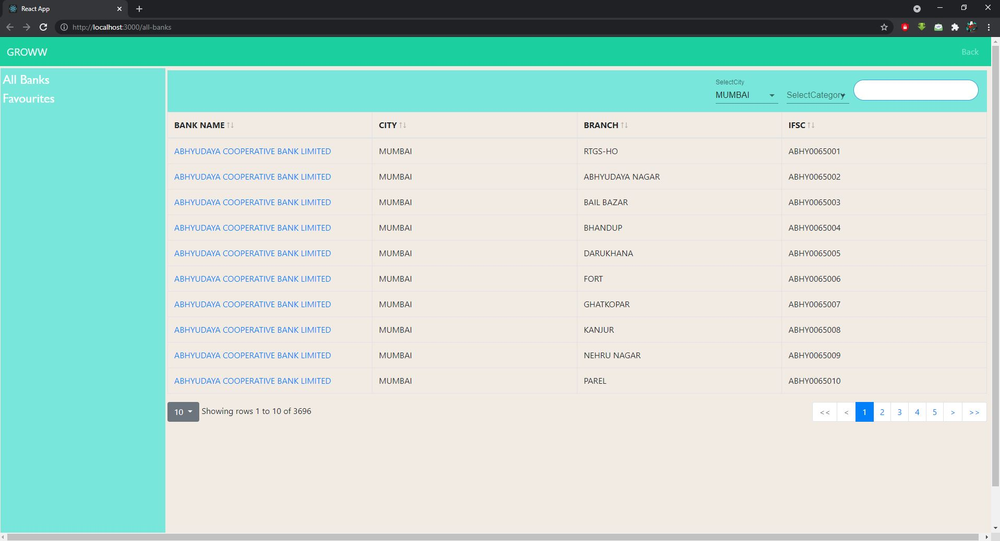
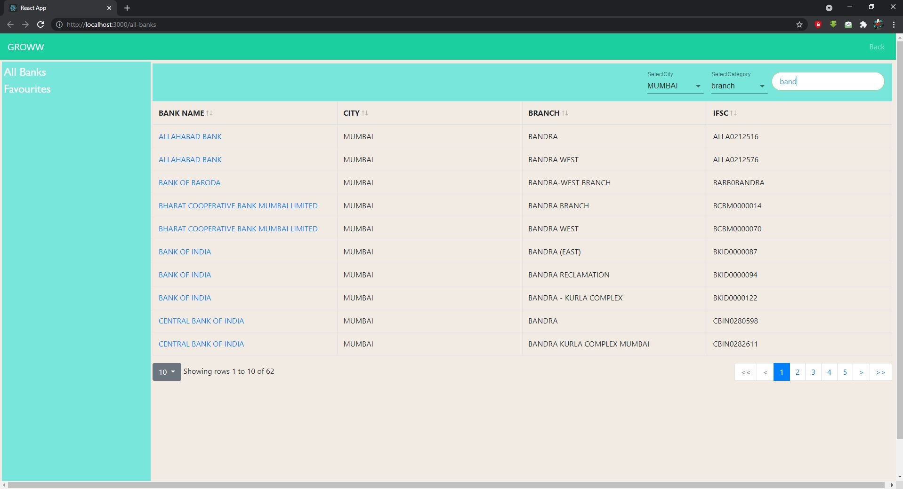
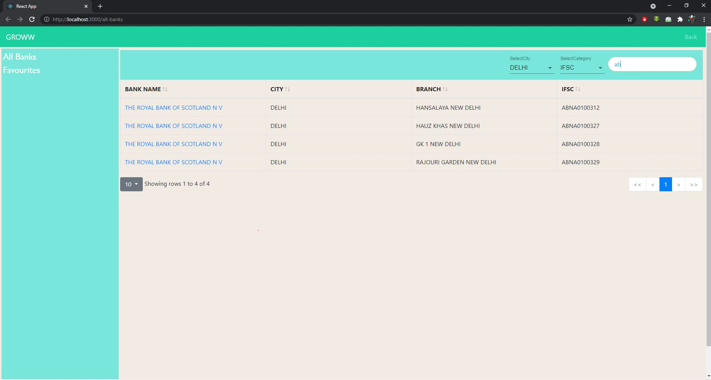
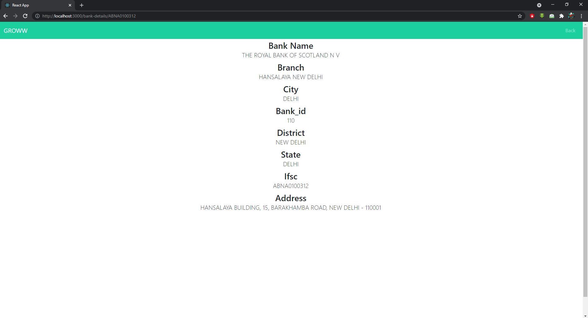

# Getting Started with Search Your Bank App
Welcome to Search Your Bank App, it helps you to search filter, banks !. The App is built on top of ReactJS.

## Use a production Version
The production version is hosted at [https://groww-app-assignment.herokuapp.com/all-banks](https://groww-app-assignment.herokuapp.com/all-banks)

## Use the development Version

- Make sure, the latest version of Node and NPM are installed!
- Clone the project!
- Install the necessary NPM dependencies using `npm install`.
- To start the project, use `npm start`.
- Runs the app in the development mode.
- Open [http://localhost:3000](http://localhost:3000) to view it in the browser.

## Algorithm/Features

- The list of the banks is stored  in a server.
- Whenever a user changes the city from `SelectCity` options an Api call is invoked  and shows the result.
- Also, it clears  any values/options selected or written in `SelectCategory` and `SearchBar`.
- A user can filter the result. For that he needs to  select any category first and then type in `SearchBar`.
- `SearchBar` is search as you type.
- The bank name is connected to its bank details via IFSC code because it is unique for each bank. So, when a user clicks on the name he gets directed to the bank details.
  
## Error Handling

- If a user tries to search directly without selecting any category, it will not filter  the result.
- Async await has been used to check the response from the server is valid or not.

## ScreenShots 

